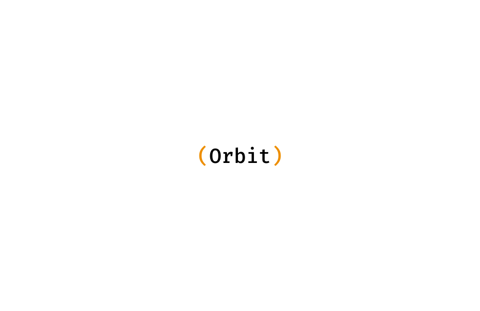

# Orbit GraphQL


It is a cached proxy for your GraphQL API with automatic purging.

1. Deploy it in front of GraphQL API, and it will start caching all requests passing through it.
2. Your cache gets automatically invalidated if anything changes in your application (when you send a `mutation`)
3. Queries are only sent to origin if there is a cache MISS

- [Why?](#why)
- [How does it work?](#how-does-it-work)
- [Getting Started](#getting-started)
  - [Prerequisites](#prerequisites)
  - [Installation](#installation)
  - [Docker](#docker)
  - [Testing](#testing)
- [Usage](#usage)
- [Configuration](#configuration)
- [License](#license)
- [Acknowledgements](#acknowledgements)

## Why?

Because all GraphQL requests are on a single endpoint and resources are differentiated based on what your request body looks like, we can't use HTTP caching methods for them (say goodbye to etags, 304s, etc.)

Currently the ecosystem solves for the problem in two ways, client side cache or a server side cache. Orbit GraphQL is a solution to setting up a server side cache for your GraphQL API.

## How does it work?

You can find details on it is implemented [here](https://docs.orbitgraphql.com/how-does-it-work).

## Getting Started

### Prerequisites

To build the project locally, you need to have `Go` installed on your machine - [_Installing Go_](https://go.dev/doc/install)

### Running

Once you have the project cloned,

1. Run the following command in the project directory to install/download all dependencies

```
go mod tidy
```

2. Update the configuration in the `config.toml` file (add your origin URL, the port, etc.)
3. Run the command below to start the cache server

```
go run main.go
```

4. That's it! You can start making requests to your cache server.

### Building

You can build the executable for the server by running the command below

```
go build -o orbitgraphql main.go
```

This will build the binary on your machine.

Please note, the build binary will need the `config.toml` file in the same directory if you're providing configuration in the file. You can also provide configuration for the server using envionment variables.

### Docker

First thing you need to do is run the server. You can run it using Docker.

#### Docker Build

```sh
docker build . -t orbitgraphql
```

#### Running the Docker container

```sh
docker run -p 9090:9090 -e ORBIT_ORIGIN=http://localhost:8080/graphql orbitgraphql
```

All requests to `localhost:9090/` will be proxied to `localhost:8080/graphql` and requests which result in a cache `HIT` will be served directly.

### Testing

There are a few integration tests (written by me) and a few unit tests (written by Github Copilot).

To run tests locally you will need to start the test Todo API.

```
go run test_api/todo/server.go
```

This will start the test origin server. There is a delay of `100ms` added to every request so we can try to pretend like our origin API is slow.

Next up, start the cache server by running

```
go run main.go
```

That's it. Once both servers are up and running, run the command below to run the test suite.

```
go test ./... -v -count=1
```

## Usage

You can start sending the same GraphQL requests you were sending to your origin API to the Orbit server on the `/graphql` path. If the server is running on `localhost:9090`, you can your requests to `localhost:9090/graphql`

The system also has few other endpoints to help you flush/purge the cache. You can details about all of them [here](https://docs.orbitgraphql.com/configuration-options#handlers-graphql-path).

## Configuration

You can configure the origin URL, the port the server runs on, the cache backend to use (currently in memory and redis are supported), and a few more things.

The system takes configuration in two ways,

1. The `config.toml` file in your project directory
2. Environment variables

The configuration is read from the `config.toml` file. You can also override the configuration using environment variables.

The details all options available can be found here: [_Configuration Options_](https://docs.orbitgraphql.com/configuration-options).
You can also check out the sample config file here: [_Sample Config File_](https://github.com/orbitgraphql/orbitgraphql/blob/main/config.toml)

## License

The code is licensed under [FSL-1.1-Apache-2.0](https://github.com/nshntarora/orbitgraphql/blob/main/LICENSE.md).

## Acknowledgements

I built this because of an itch,

I wanted a cache in front of my API -> Went out looking for open source solutions -> Didn't find a great tool for my setup -> Started using Stellate (loved the product! <3) -> Still wanted to solve this problem (for fun)

This project is **heavily** inspired from,

1. [Stellate](https://stellate.co) (Max's [talks](https://www.youtube.com/watch?v=EjrJtp4JaGQ) were super [helpful](https://www.youtube.com/watch?v=fALF1ILczo8))
2. [urql](https://github.com/urql-graphql/urql/tree/main/exchanges/graphcache)
